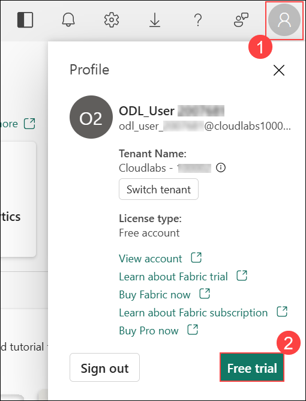
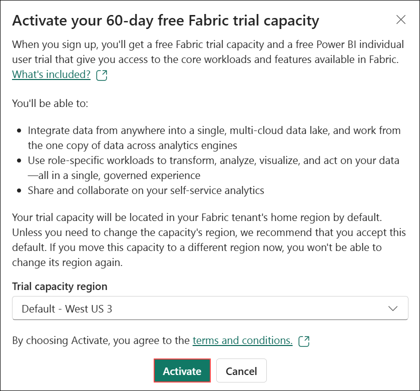
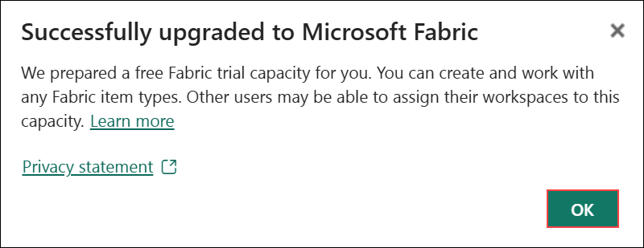
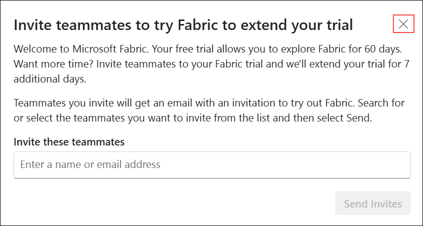
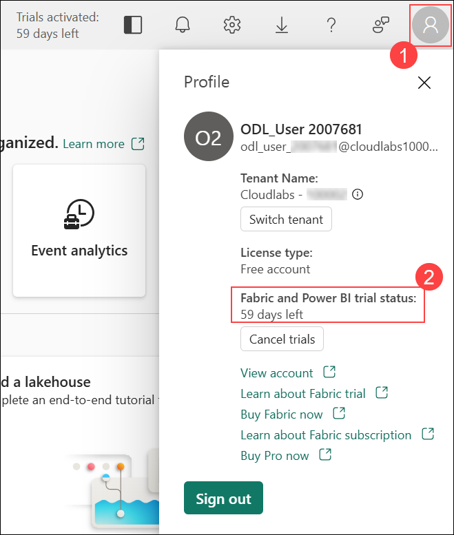
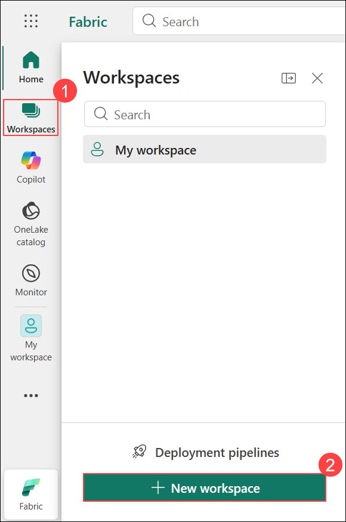
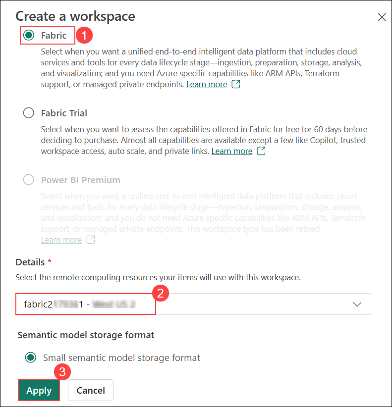
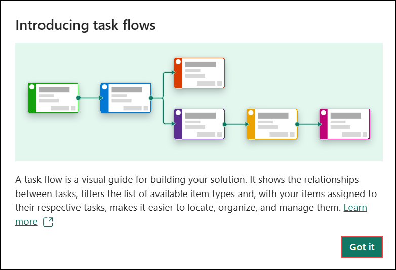

# Exercise 1: Create a Fabric workspace

### Estimated Duration: 20 minutes

In this exercise, you will go through the process of signing up for the Microsoft Fabric Trial and setting up a workspace. This serves as the initial step in familiarizing yourself with the Microsoft Fabric platform. By creating a workspace, you will establish a dedicated environment where you can explore and interact with the wide range of tools and services Microsoft Fabric offers, including data integration, analytics, and visualization. This foundational setup is essential for understanding how to manage and organize resources within Fabric, as well as how to collaborate effectively across teams and projects within the platform.

## Lab objectives

You will be able to complete the following tasks:

- Task 1: Sign up for Microsoft Fabric Trial
- Task 2: Create a workspace

### Task 1: Sign up for Microsoft Fabric Trial

In this task, you will initiate your 60-day free trial of Microsoft Fabric by signing up through the Fabric app, providing access to its comprehensive suite of data integration, analytics, and visualization tools

1. On the **Power BI homepage**, select the **Profile icon (1)**, and then choose **Free trial (2)**.

     

1. On the **Activate your 60-day free Fabric trial capacity** pane, keep the default **Trial capacity region**, and then select **Activate**.

      

1. On the **Successfully upgraded to Microsoft Fabric** pop-up, select **OK**.

      

1. On the **Invite teammates to try Fabric to extend your trial** pop-up, select **Close**.

      

1. Select the **Profile icon (1)** and verify the **Fabric and Power BI trial status (2)**.

      
      
### Task 2: Create a workspace

Here, you create a Fabric workspace. The workspace contains all the items needed for this lakehouse tutorial, which includes lakehouse, dataflows, Data Factory pipelines, notebooks, Power BI datasets, and reports.

1. Select **Workspaces (1)**, and then choose **+ New workspace (2)**.

    

1. Fill out the **Create a workspace** form with the following details:

   - **Name:** Enter **fabric-<inject key="DeploymentID" enableCopy="false"/>**
   - **Advanced:** Expand it, under **License mode** select **Fabric (1)**, under **Capacity** select **fabric<inject key="DeploymentID" enableCopy="false"/> - <inject key="Region"></inject> (2)**, and then select **Apply (3)**.

      
 
      

1. On the **Introducing task flows** pop-up, select **Got it**.

    

### Summary

In this exercise, you have signed up for Microsoft Fabric Trial and created a workspace.

### Review 
In this lab, you have completed:

 + Signed up for Microsoft Fabric Trial
 + Created a workspace

### You have successfully completed the lab. Click on Next >> to procced with next Exercise.
