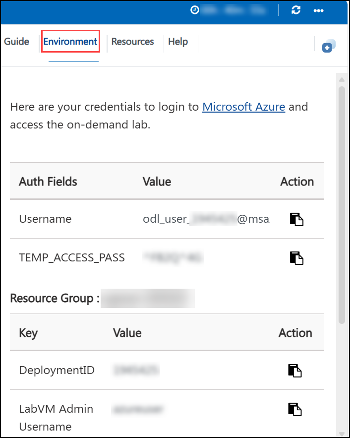
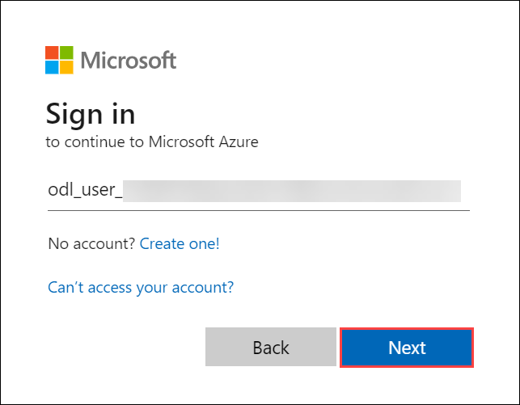

# Cloud Scale Analytics with Microsoft Fabric

### Overall Estimated Duration : **90 Minutes**

## Overview

Microsoft Fabric is a unified data platform that combines data engineering, data warehousing, and business intelligence tools into a cohesive environment. By leveraging Microsoft Fabric, you can effectively manage, analyze, and visualize large datasets, enabling powerful data-driven decision-making.

In this hands-on lab, you will explore and set up Microsoft Fabric by creating a workspace and assigning the Fabric Administrator role. You will then create a Lakehouse to centralize and manage data, followed by uploading files for analysis. Additionally, you will learn how to create and manage dataflows in Microsoft Fabric to efficiently ingest, transform, and store data. You will create a Dataflow (Gen2) to ingest data from an external source, perform transformations using Power Query, and define a data destination in a Lakehouse. Furthermore, you will integrate the Dataflow into a Data Pipeline to automate and orchestrate the ETL (Extract, Transform, Load) process. This lab provides hands-on experience with Microsoft Fabric’s data management and pipeline orchestration capabilities.

## Objective

This lab provides hands-on experience with Microsoft Fabric’s data management and pipeline orchestration capabilities.

- **Getting Started with Microsoft Fabric:** Learn how to create and manage a workspace in Microsoft Fabric by assigning the Fabric Administrator role, setting up a new workspace for data and analytics projects, and organizing your work effectively. Additionally, gain hands-on experience in setting up a Lakehouse within the workspace and uploading data files (e.g., CSV) to the Lakehouse, laying the foundation for future data analysis and processing.

- **Create a Dataflow (Gen2) in Microsoft Fabric:** In this lab, participants will learn how to create and manage Dataflows (Gen2) in Microsoft Fabric to efficiently ingest, transform, and store data. They will explore how to import data from external sources, apply transformations using Power Query, and define a destination in a Lakehouse. The lab will also cover integrating Dataflows into Data Pipelines to automate and orchestrate the ETL (Extract, Transform, Load) process, providing practical experience in managing data workflows and optimizing data processing tasks within Microsoft Fabric.

## Prerequisites

Participants should have:

- **Basic Knowledge of Microsoft Azure**: Familiarity with the Azure portal and the process of role assignments within Azure Active Directory (Entra ID).
- **Understanding of Workspace Creation**: Familiarity with the concept of workspaces in cloud platforms and how to create and configure them.
- **Basic Knowledge of Cloud Data Storage**: Understanding the concept of Lakehouses for organizing and storing data in cloud environments.
- **Basic File Management Skills**: Ability to upload files into a cloud-based data platform like Microsoft Fabric for further analysis.
Here are the prerequisites based on the lab objectives you provided:
- **Basic Understanding of Dataflows (Gen2)**: Familiarity with the concept of Dataflows, especially Dataflow (Gen2) in Microsoft Fabric, and how they are used for data ingestion and transformation.
- **Basic Knowledge of Data Pipelines**: Understanding of how to create and manage data pipelines in Microsoft Fabric to orchestrate ETL (Extract, Transform, Load) processes.
- **Familiarity with Microsoft Fabric Workspace**: Comfort with navigating Microsoft Fabric’s workspace, including creating new items like Dataflows and Data Pipelines.
- **Experience with Data Destination Configuration**: Ability to configure and set data destinations, such as a Lakehouse, for storing ingested data from Dataflows.

## Architecture

The architecture leverages Microsoft Fabric to create an efficient and automated data workflow, integrating workspaces, lakehouses, dataflows, and pipelines. It begins with the assignment of the **Fabric Administrator Role** to ensure proper permissions and access control. The **Workspace** is then created, serving as the central hub for managing and collaborating on data resources. Following this, a **Lakehouse** is set up as the data storage solution, allowing for scalable and efficient storage of large datasets. Files are uploaded to the Lakehouse, populating it with the necessary data for further processing. Next, a **Dataflow (Gen2)** is configured to ingest, transform, and load (ETL) data from external sources. The transformed data is directed into the Lakehouse as the destination for storage. Finally, the **Dataflow** is integrated into a **Data Pipeline**, which automates the data ingestion and transformation process, ensuring the data remains up-to-date and organized within the Lakehouse.

This architecture establishes a seamless flow from data storage setup to automated data ingestion, transformation, and orchestration, providing an efficient environment for data management and analysis within Microsoft Fabric.

## Architecture Diagram 

## Explanation of Components

The architecture for this lab involves the following key components:

### Lab 01 Components:

- **Fabric Administrator Role:** Ensures that the necessary permissions are granted to manage the workspace effectively, enabling access control and administrative capabilities.

- **Workspace:** A central environment where data and resources are managed. The workspace acts as the foundation for organizing and collaborating on data storage and analysis tasks.

- **Lakehouse:** A data storage solution designed for structured and unstructured data. The Lakehouse enables efficient data organization and facilitates analysis tasks.

- **Data Ingestion Tools:** Enables uploading of files into the Lakehouse to populate datasets required for analysis and querying. 

### Lab 02 Components:

- **Dataflow (Gen2) for Data Ingestion:**  
  The Dataflow (Gen2) is a powerful component in Microsoft Fabric that enables users to perform data extraction, transformation, and loading (ETL). Dataflow is used to ingest data from an external source, such as a CSV file. It allows users to define the steps needed to clean, transform, and structure the data for further processing or analysis.

- **Power Query Editor for Data Transformation:**  
  The Power Query Editor is used within the Dataflow to perform data transformations. users can apply transformations like adding custom columns, changing data types, and modifying data formats to suit the required output. This transformation process prepares the data for optimal storage and future use.

- **Lakehouse as Data Destination:** Lakehouse is configured as the destination for the dataflow. The Lakehouse serves as a storage solution for the transformed data, allowing users to store large datasets in a scalable, organized manner. Data from the Dataflow is mapped and written to Lakehouse tables for further use in analysis or reporting.

- **Data Pipeline for Orchestration:** Dataflow is integrated into a Data Pipeline to automate the data ingestion and transformation process. The Data Pipeline orchestrates the flow of data, ensuring that the Dataflow runs as part of an automated process, reducing manual intervention and ensuring that data is regularly updated in the destination (Lakehouse).

## Getting Started with the Lab Environment

## Accessing Your Lab Environment

Once you're ready to begin, your virtual machine and lab guide will be available directly within your web browser.

## Virtual Machine & Lab Guide

The virtual machine provides access to the Azure Portal and Microsoft security portals.  
The lab guide remains visible throughout the lab exercises.

## Exploring Your Lab Resources

Navigate to the **Environment** tab to review lab resources and credentials.

## Utilizing the Split Window Feature

Use the **Split Window** button in the top-right corner to open the lab guide in a separate window for easier navigation.

## Managing Your Virtual Machine

Start, stop, or restart your virtual machine as needed from the **Resources** tab.

## Lab Guide Zoom In / Zoom Out

Adjust the zoom level using the **A↕ : 100%** icon located next to the timer.

## Let's Get Started with Azure Portal

1. On the virtual machine, click the **Azure Portal** icon:

    

1. On the **Sign in to Microsoft Azure** page, enter:

   - **Email/Username:** <inject key="AzureAdUserEmail" enableCopy="true"/>

       

1. Enter the password:

   - **Password:** <inject key="AzureAdUserPassword" enableCopy="true"/>

      

1. Select **No** when prompted to stay signed in.

   

## Support Contact

CloudLabs support is available 24/7 to assist learners and instructors.

- **Email:** cloudlabs-support@spektrasystems.com  
- **Live Chat:** https://cloudlabs.ai/labs-support  

Now, click on **Next** from the lower right corner to move on to the next page. 

### Happy Learning!!
