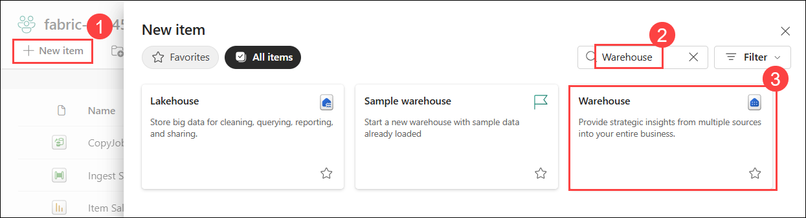
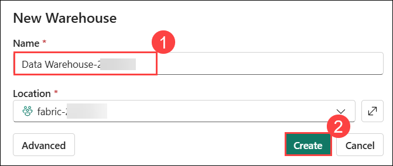
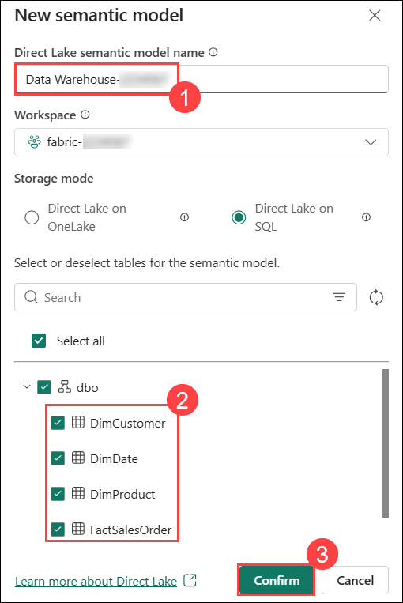
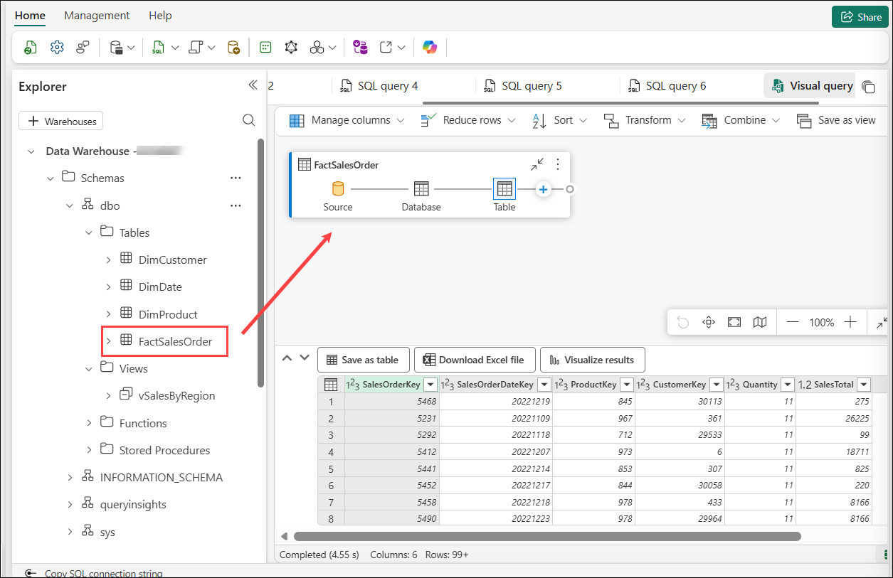
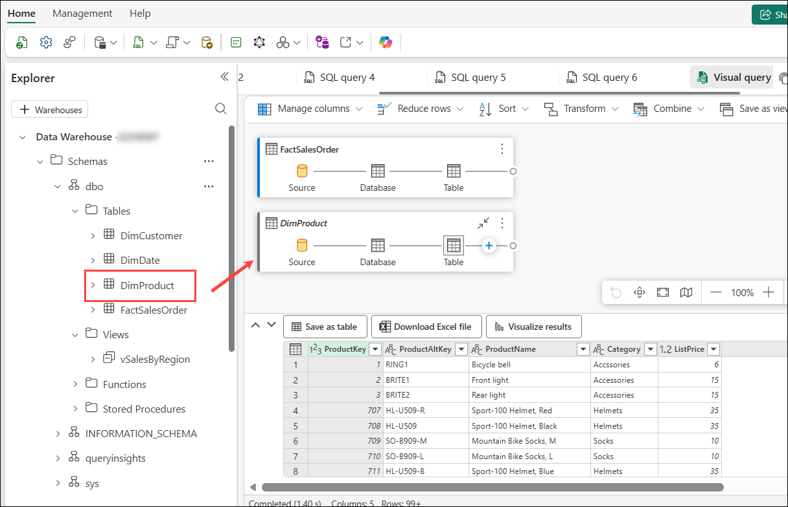
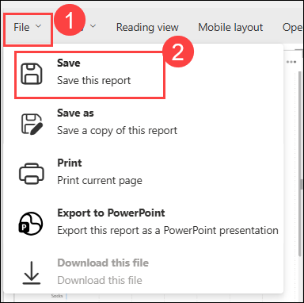

# Exercise 2: Analyze data in a data warehouse

### Estimated Duration: 90 Minutes

## 📘 Scenario

Contoso Retail’s analytics team now needs to organize and analyze sales data within a **structured data warehouse environment**. To support business reporting and performance analysis, the team must create warehouse tables, define relationships between datasets, and build reusable analytical queries and reports.

In this exercise, you will help Contoso create a data warehouse, populate fact and dimension tables, build a relational data model, analyze sales data using SQL and visual queries, and create reports for business insights.

## 📖 Overview

In this exercise, you will use Microsoft Fabric to **create and analyze a relational data warehouse**. You will create warehouse tables, load sample data, define relationships between fact and dimension tables, run SQL queries for analysis, create reusable views, and build visual reports using the semantic model and reporting capabilities in **Microsoft Fabric**. This will enable you to derive insights from the data and support data-driven decision-making for Contoso Retail.

## 🎯 Objectives

In this exercise, you will be able to complete the following tasks:

- Task 1: Create a data warehouse
- Task 2: Create tables and insert data
- Task 3: Define a data model
- Task 4: Query data warehouse tables
- Task 5: Create a view
- Task 6: Create a visual query
- Task 7: Visualize your data

## Task 1: Create a data warehouse

In this task, you will design and implement a data warehouse by organizing data from multiple sources, creating ETL processes, and optimizing for performance. The goal is to enable efficient querying and reporting while ensuring security, compliance, and scalability.

1. From the left navigation pane, click on **Workspaces (1)** from the left pane and select your workspace **fabric-<inject key="DeploymentID" enableCopy="false"/> (2)**.

    
   
1. Click on **+ New item (1)** to create a new warehouse. In the search box, search **Warehouse (2)** and select **Warehouse** **(3)** from the list.
    
    

1. Enter the following details to create a **Warehouse**:

    - **Name:** Enter **Data Warehouse-<inject key="DeploymentID" enableCopy="false"/>** **(1)**

    - Click on **Create (2)**

      

## Task 2: Create tables and insert data

In this task, you will create database tables by defining their structure with appropriate columns and constraints. Afterwards, you'll insert data into the tables, ensuring it is ready for querying and further operations.

1. In your new warehouse, under **Build a warehouse**, select the **T-SQL** tile.

   

1. Enter the following **SQL Code (1)** and click the **&#9655; Run (2)** button to run the SQL script, which creates a new table named **DimProduct** in the **dbo** schema of the data warehouse.

    ```SQL
   CREATE TABLE dbo.DimProduct
   (
       ProductKey INTEGER NOT NULL,
       ProductAltKey VARCHAR(25) NULL,
       ProductName VARCHAR(50) NOT NULL,
       Category VARCHAR(50) NULL,
       ListPrice DECIMAL(5,2) NULL
   );
   GO
    ```

   

1. Use the **Refresh (1)** button on the toolbar to refresh the view. Then, in the **Explorer** pane, expand **Schemas (2)** > **dbo (3)** > **Tables (4)** and verify that the **DimProduct (5)** table has been created.

   

1. On the **Home** menu tab, use the **New SQL Query (1)** button and from the drop-down select **New SQL Query (2)**  to create a new query, and enter the following INSERT statement:

    

    ```SQL
   INSERT INTO dbo.DimProduct
   VALUES
   (1, 'RING1', 'Bicycle bell', 'Accessories', 5.99),
   (2, 'BRITE1', 'Front light', 'Accessories', 15.49),
   (3, 'BRITE2', 'Rear light', 'Accessories', 15.49);
   GO
    ```

1. Run the above query to insert three rows into the **DimProduct** table.

    

1. On the Home menu tab, use the **New SQL Query** button to create a new query for the table.

1. On the **Lab VM** and navigate to the following path: `C:\LabFiles\Files\`

1. Open the file **`create-dw-01.txt`** and copy the Transact-SQL code related to the **`DimProduct`** table.

1. Paste the copied code into the new query window.

1. Next, open the files **`create-dw-02.txt`** and **`create-dw-03.txt`**, one after the other, and copy their contents.

   

1. Paste the code from both files **below the existing code** in the **same query window**.

1. Once you have combined the code from all three files into a single query window, click **Run** to execute the query. This will create a basic data warehouse schema and populate it with sample data. The execution should take approximately **30 seconds** to complete.

     

1. Use the **Refresh** button on the toolbar to refresh the view. Then, in the **Explorer** pane, verify that the **dbo** schema in the data warehouse now contains the following four tables:
   
    - **DimCustomer**
    - **DimDate**
    - **DimProduct**
    - **FactSalesOrder**

       

        > **Note:** If the schema takes a while to load, just refresh the browser page.

## Task 3: Define a data model

In this task, you will create a relational data warehouse consisting of fact and dimension tables, where fact tables hold numeric measures for analysis and dimension tables store entity attributes. You'll define relationships between tables in Microsoft Fabric to build a data model for efficient business performance analysis.

1. In the Data warehouse, from the top navigation pane, select the **New semantic model** option.

    
    
1. Provide the Direct Lake semantic model name as **Data Warehouse-<inject key="DeploymentID" enableCopy="false"/> (1)** and select **DimCustomer, DimDate, DimProduct, FactSalesOrder (2)** tables from the list. Then, click on **Confirm (3)**.

    

1. Go back to the **fabric-<inject key="DeploymentID" enableCopy="false"/> (1)** workspace. Select the recently created semantic model named as **Data Warehouse-<inject key="DeploymentID" enableCopy="false"/> (2)**.

    

1. On the **Data Warehouse details** page, click **Open** to launch the semantic model editor.  

   

1. On the **Viewing (1)** menu, select **Editing (2)** to enable edit mode.  

   

1. In the editing mode, rearrange the tables in your data warehouse so that the **FactSalesOrder** table is in the middle, like this:

    

1. In the **Home** tab, click on **Manage relationships**.

    

1. In the Manage relationships window, select **+ New relationship**.

    

1. In the **New relationship** window, confirm the following:
   
    - **From table (1)**: FactSalesOrder
    - **Column (2)**: ProductKey
    - **To table (3)**: DimProduct
    - **Column (4)**: ProductKey
    - **Cardinality (5)**: Many to one (*:1)
    - **Cross filter direction (6)**: Single
    - **Make this relationship active (7)**: Selected
    - **Assume referential integrity (8)**: Unselected
    - Click **Save (9)**.

       

1. Repeat the process to create many-to-one relationships between the following tables and click on **Save**.

    - **FactSalesOrder.CustomerKey** &#8594; **DimCustomer.CustomerKey**
       
       

    - **FactSalesOrder.SalesOrderDateKey** &#8594; **DimDate.DateKey**
         
       

1. When all of the relationships have been defined, the model should look like this:

    

> **Congratulations** on completing the task! Now, it's time to validate it. Here are the steps:
> - If you receive a success message, you can proceed to the next task.
> - If not, carefully read the error message and retry the step, following the instructions in the lab guide. 
> - If you need any assistance, please contact us at cloudlabs-support@spektrasystems.com. We are available 24/7 to help you out.

<validation step="ed2c6226-96ee-48e8-b8f1-205dae3aaf6b" />

## Task 4: Query data warehouse tables

In this task, you will query data warehouse tables using SQL to retrieve and analyze data. Most queries will involve aggregating and grouping data with functions and GROUP BY clauses, as well as joining related fact and dimension tables using JOIN clauses.

1. Switch back to **Data Warehouse-<inject key="DeploymentID" enableCopy="false"/>** from the top. Create a **New SQL Query** from the top Menu bar, and run the following code:

    

    ```SQL
   SELECT  d.[Year] AS CalendarYear,
            d.[Month] AS MonthOfYear,
            d.MonthName AS MonthName,
           SUM(so.SalesTotal) AS SalesRevenue
   FROM FactSalesOrder AS so
   JOIN DimDate AS d ON so.SalesOrderDateKey = d.DateKey
   GROUP BY d.[Year], d.[Month], d.MonthName
   ORDER BY CalendarYear, MonthOfYear;
    ```
    
   
1. Note that the attributes in the time dimension enable you to aggregate the measures in the fact table at multiple hierarchical levels- in this case, year and month. This is a common pattern in data warehouses.

    

1. Click on **New SQL Query (1)** from the top menu bar and create a query **(2)** as follows to add a second dimension to the aggregation.

    ```SQL
   SELECT  d.[Year] AS CalendarYear,
           d.[Month] AS MonthOfYear,
           d.MonthName AS MonthName,
           c.CountryRegion AS SalesRegion,
          SUM(so.SalesTotal) AS SalesRevenue
   FROM FactSalesOrder AS so
   JOIN DimDate AS d ON so.SalesOrderDateKey = d.DateKey
   JOIN DimCustomer AS c ON so.CustomerKey = c.CustomerKey
   GROUP BY d.[Year], d.[Month], d.MonthName, c.CountryRegion
   ORDER BY CalendarYear, MonthOfYear, SalesRegion;
    ```

   

4. Run the modified query and review the results, which now include Sales Revenue aggregated by Year, Month, and Sales Region.

    

## Task 5: Create a view

In this task, you will create a view in the data warehouse to encapsulate SQL logic for easier querying and data abstraction. A Microsoft Fabric data warehouse offers similar capabilities to relational databases, allowing you to create views and stored procedures to streamline complex queries and improve data access efficiency.

1. Modify and run the query you created previously as follows to create a view (note that you need to remove the ORDER BY clause to create a view).

    ```SQL
   CREATE VIEW vSalesByRegion
   AS
   SELECT  d.[Year] AS CalendarYear,
           d.[Month] AS MonthOfYear,
           d.MonthName AS MonthName,
           c.CountryRegion AS SalesRegion,
          SUM(so.SalesTotal) AS SalesRevenue
   FROM FactSalesOrder AS so
   JOIN DimDate AS d ON so.SalesOrderDateKey = d.DateKey
   JOIN DimCustomer AS c ON so.CustomerKey = c.CustomerKey
   GROUP BY d.[Year], d.[Month], d.MonthName, c.CountryRegion;
    ```
    

2. After execution is completed, it will create a view. **Refresh (1)** the data warehouse schema once and verify that the new view **vSalesByRegion (2)** is listed in the **Explorer** pane.

    

3. Create a **New SQL query** from the top Menu bar and run the following SELECT statement:

    ```SQL
   SELECT CalendarYear, MonthName, SalesRegion, SalesRevenue
   FROM vSalesByRegion
   ORDER BY CalendarYear, MonthOfYear, SalesRegion;
    ```

## Task 6: Create a visual query

In this task, you will create a visual query using the graphical query designer to query data warehouse tables without writing SQL code. Similar to Power Query online, this no-code approach allows you to perform data transformations, and for more complex tasks, you can leverage Power Query's M language.

1. On the **Home** menu, select **New visual query (2)** from the **New SQL Query (1)** drop-down.

    

1. From Tables, drag **FactSalesOrder** onto the **canvas**. Notice that a preview of the table is displayed in the **Preview** pane below.

    

1. And then, drag **DimProduct** onto the **canvas**. We now have two tables in our query.

    

1. Select the **FactSalesOrder** table and click the **+ (1)** button and then click on **Merge queries (2)**.

    

   > **Note:** If the + option is not visible, click on the three dots (i.e., the Actions button) to view the required options. 

1. In the **Merge queries** window, select **DimProduct (1)** as the **Right table for merge**. Select **ProductKey  (2)** in both queries, leave the default **Left outer (3)** to join type, and click **OK (4)**.

   

1. In the **Preview**, note that the new **DimProduct** column has been added to the FactSalesOrder table. Expand the column by clicking the **double arrow (1)** to the right of the column name. Select **ProductName (2)** and click **OK (3)**.

    

1. If you're interested in looking at data for a single product, per a manager's request, you can now use the **ProductName** column to filter the data in the query. For example, filter the **ProductName** column to look at **Cable Lock** data only.

    

1. From here, you can analyze the results of this single query by selecting **Visualize results** or **Download Excel file**. You can now see exactly what the manager was asking for, so we don't need to analyze the results further.

## Task 7: Visualize your data

In this task, you will visualize your data from a single query or your data warehouse to gain insights and present findings effectively. Before creating visualizations, it's important to hide any columns or tables that may clutter the report and are not user-friendly for report designers.

1. Navigate back to the fabric workspace **fabric-<inject key="DeploymentID" enableCopy="false"/> (1)** and click on **Data Warehouse-<inject key="DeploymentID" enableCopy="false"/> (2)** semantic model to open it.

    

1. On the **Data Warehouse details** page, click **Open** to launch the semantic model editor.  

   

1. Click the **Viewing (1)** dropdown and change it to **Editing (2)** to switch modes.

    

1. Hide the following columns in your Fact and Dimension tables that are not necessary to create a report. Note that this does not remove the columns from the model; it simply hides them from view on the report canvas. Right-click on the column name and select **Hide in report view**.
   
    - From FactSalesOrder
        - **SalesOrderDateKey**
        - **CustomerKey**
        - **ProductKey**

           
   
    - From DimCustomer
        - **CustomerKey**
        - **CustomerAltKey**
   
    - From DimDate
        - **DateKey**
        - **DateAltKey**
   
    - From DimProduct
        - **ProductKey**
        - **ProductAltKey** 

1. From the **File (1)** tab, select **Create new report (2)**. This will open a new window, where you can create a Power BI report.

    

1. In the **Data** pane, expand **DimProduct**. Note that the columns you hide are no longer visible. 

    

1. Select **Category**. This will add the column to the **Report canvas**. Because the column is a numeric value, the default visual is a **column chart**.

    

1. Ensure that the column chart on the canvas is active (with a grey border and handles), and then select **SalesTotal** from the **FactSalesOrder** table to add a category to your column chart.

    

1. In the **Visualizations** pane, change the chart type from a column chart to a **clustered bar chart**. Then resize the chart as necessary to ensure that the categories are readable.

    

1. In the **Visualizations** pane, select the **Format your visual (1)** tab and in the **General (2)** sub-tab, in the **Title** section, change the **Text** to **Total Sales by Category (3)**.

   

1. In the **File (1)** menu, select **Save (2)**. select **fabric-<inject key="DeploymentID" enableCopy="false"/> (3)**, enter a name as **Sales Report (4)**, and click the **Save (5)** button.

   

   

1. In the menu hub on the left pane, navigate back to your **workspace**. Notice that you now have three items saved in your workspace: your data warehouse, its semantic model (default), and the report you created.

   

## 🧾 Summary

In this exercise, you

- Created a data warehouse containing multiple related tables.
- Used SQL to:

    - Insert data into the tables.
    - Query the data for analysis.

- Leveraged the visual query tool to explore and transform the data.
- Enhanced the data model for the default dataset in the data warehouse.
- Used the enhanced dataset as the source for building a report.

### You have successfully completed the exercise. Click on **Next >>** to proceed with the next exercise.

   
