# Exercise 3: Get started with Real-Time Analytics in Microsoft Fabric

### Estimated Duration: 75 Minutes

## 📘 Scenario

Contoso Retail’s analytics team now requires **real-time visibility into operational and sales data** to support faster business analysis and monitoring. To achieve this, the team plans to use **Real-Time Analytics** capabilities in Microsoft Fabric for querying live and historical data streams.

In this exercise, you will help Contoso create a KQL database, ingest sales data for analysis, run KQL queries to extract insights, build reports from query results, and simulate streaming IoT device data using Delta tables and Spark Structured Streaming.

## 📖 Overview

In this exercise, you will explore **Real-Time Analytics capabilities** in Microsoft Fabric using Kusto Query Language (KQL). You will create a KQL database, ingest and query sales data, create a Power BI report from KQL query results, and use Delta tables with Spark Structured Streaming to process simulated streaming data in real time.

## 🎯 Objectives

In this exercise, you will be able to complete the following tasks:

- Task 1: Create a KQL database
- Task 2: Use KQL to query the sales table
- Task 3: Create a Power BI report from a KQL Queryset
- Task 4: Use delta tables for streaming data
  
## Task 1: Create a KQL database

In this task, Contoso needs to set up a KQL database to analyze sales data. You will create an Eventhouse, set up a KQL database, and ingest sales data from a CSV file to enable querying and analysis using KQL.

> **Information:** In this task, you are importing a static file to create a table in your KQL database. This allows you to run KQL queries on the data in the table. In reality, you can also set up streaming data ingestion into KQL databases from sources such as Azure Event Hubs or Azure IoT Hub, enabling real-time analytics on streaming data. 

1. From the left navigation pane, click on **fabric-<inject key="DeploymentID" enableCopy="false"/> (1)** from the left pane and select your workspace **fabric-<inject key="DeploymentID" enableCopy="false"/> (2)**.

    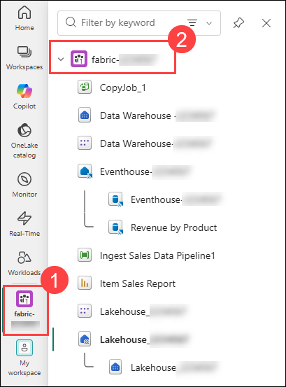
   
1. Click on **+ New item (1)** and in the New item, search for **Eventhouse (2)** and select **Eventhouse (3)** from the **Store data** list.

    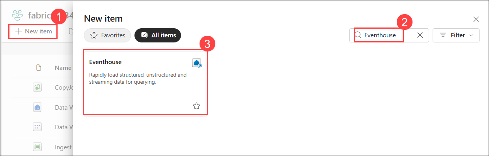

1. Enter the **Eventhouse name** as **Eventhouse-<inject key="DeploymentID" enableCopy="false"/> (1)** and click on **Create (2)**.

    

1. In the **Welcome to Eventhouse!** pop-up window, click on **Get started** and close the pop-up windows that follow.

    

1. Once the Eventhouse is created, click **+ Database (1)** from the top menu to create a new **KQL Database**.

   

1. Enter the following details:

   - **Database name:** Enter **KQL-Database<inject key="DeploymentID" enableCopy="false"/> (2)**.

   - Click on **Create (3)**.

     

1. In the center of the screen, click on **Get data (1)** and then click on **Local file (2)**.

   

1. Use the wizard to import the data into a new table by selecting the following options:
   
   - **Source:** The local file is the Source. 
   
   - **Configure:**
      - **Database:** *The database you created is already selected*
      - **Table:** Click on **+ New table**.
      - **Name:**  **sales (1)**.
      - **Source type:** File
      - **Upload files:** Drag or Browse for the file from **C:\LabFiles\Files\sales.csv (2)**
      - Click **Next (3)**

        

    - **Inspect:** Preview the data, enable **First row header (1)** and click on **Finish (2)**.

        
       
   - **Summary:**
   
      - Review the preview of the table and close the wizard.

        

## Task 2: Use KQL to query the sales table

In this task, you will use Kusto Query Language (KQL) to analyze the sales data that you ingested into your KQL database. You will run a series of KQL queries to extract insights from the sales data, such as filtering for specific products, analyzing sales over time, and summarizing revenue by product.

1. In the **Eventhouse-<inject key="DeploymentID" enableCopy="false"/>**, make sure you have the **sales** table highlighted. Click on sales **Ellipsis ... (1)** table, select the **Query with code (2)** drop-down, and from there select **Show any 100 records (3)**.

    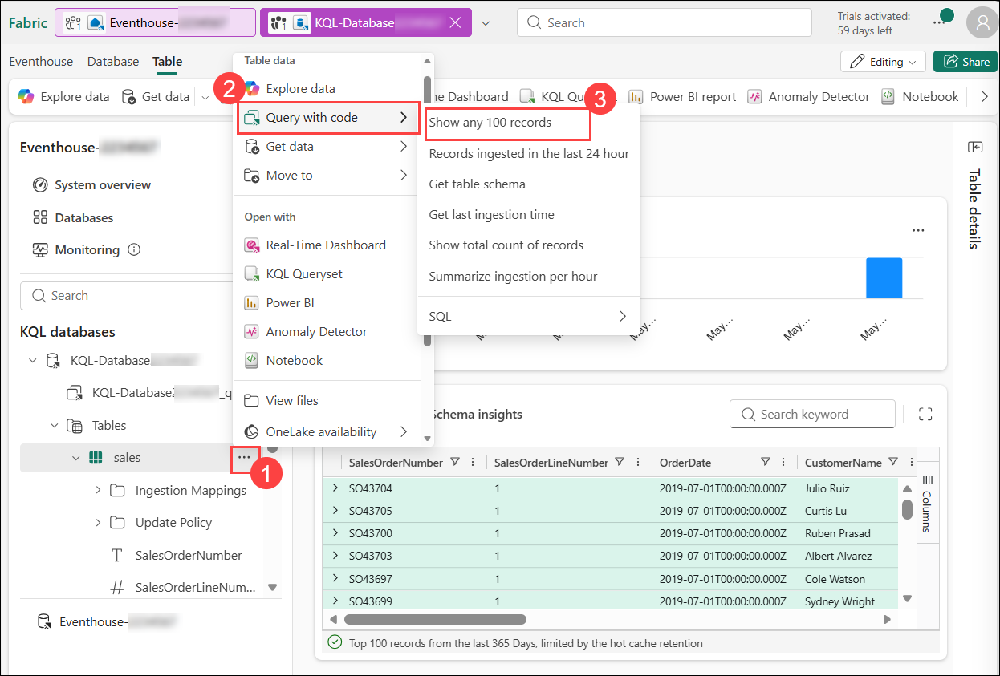

1. A new pane will open with the query and its result. 

    

1. Modify the query as follows:

    ```kusto
   sales
   | where Item == 'Road-250 Black, 48'
    ```

1. Run the query. Then review the results, which should contain only the rows for sales orders for the *Road-250 Black, 48* product.

    
   
1. Modify the query as follows:

    ```kusto
   sales
   | where Item == 'Road-250 Black, 48'
   | where datetime_part('year', OrderDate) > 2020
    ```

1. Run the query and review the results, which should contain only sales orders for *Road-250 Black, 48* made after 2020.

    

1. Modify the query as follows:

    ```kusto
   sales
   | where OrderDate between (datetime(2020-01-01 00:00:00) .. datetime(2020-12-31 23:59:59))
   | summarize TotalNetRevenue = sum(UnitPrice) by Item
   | sort by Item asc
    ```

1. Run the query and review the results, which should contain the total net revenue for each product between January 1st and December 31st, 2020, in ascending order of product name.

    

1. From the top select the drop-down next to **KQL-Database<inject key="DeploymentID" enableCopy="false"/> (1)** and then rename it as **Revenue by Product (2)**.

    

## Task 3: Create a Power BI report from a KQL Queryset

In this task, you will create a Power BI report using your KQL Queryset as the foundation for the analysis. This allows you to visualize and present the insights derived from your KQL queries in an interactive and user-friendly format within Power BI.

1. In the query workbench editor for your query set, click on **Power BI Report** to create the report and wait for the report editor to open.

    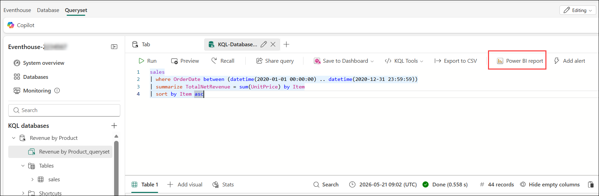

    >**Note:** If you are unable to see the Power BI Report option, click on **More (1)** and then select **Power BI Report (2)** to create the report. 
  
      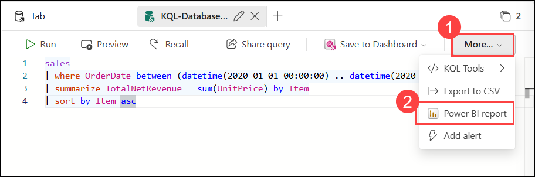
  
1. In the report editor, from the **Data** pane, expand **Kusto Query Result** and select the checkboxes of **Item** and **TotalNet Revenue (1)** fields.

1. On the report design canvas, select the table visualization that has been added, and then in the **Visualizations** pane, select **Clustered bar chart (2)**.

    

1. Now to save the report, in the **Power BI (Preview)** window, Select the **File (1)** menu, and click on **Save (2)**.

      

1. In the **Just a few details first** pane, enter the file name as **Revenue by Item (1)**, choose the workspace **fabric-<inject key="DeploymentID" enableCopy="false"/> (2)** and click **Continue (2)** to save the report in Power BI.

    

1. If you are unable to choose the workspace as instructed above, please follow the steps below other wise you can skip to step 7:

    - When you save the report, in the **Just a few details first** pane, enter the file name as **Revenue by Item (1)** and click **Continue (2)** to save the report in Power BI.

        

    -  The report has been saved successfully. Now, click on **Open the file in Power BI to view, edit, and get a shareable link** to proceed.

         

    - Click **File (1)** and then select **Save a copy (2)** to duplicate the Power BI report to your workspace.
         
         

    - Select **fabric-<inject key="DeploymentID" enableCopy="false"/> (1)** where you want to save the copied report, enter a name as **Revenue by Item (2)**, and click the **Save (3)** button to finalize the copy.
       
         

        >**Note:** Refresh the Workspace page if necessary to view all of the items it contains.

1. In the list of items in your workspace, note that the **Revenue by Item** report is listed.

    

> **Congratulations** on completing the task! Now, it's time to validate it. Here are the steps:
> - If you receive a success message, you can proceed to the next task.
> - If not, carefully read the error message and retry the step, following the instructions in the lab guide. 
> - If you need any assistance, please contact us at cloudlabs-support@spektrasystems.com. We are available 24/7 to help you out.

<validation step="87b0a9aa-50e0-43f6-a218-25d67e5f4784" />

## Task 4: Use delta tables for streaming data

In this task, you will use Delta tables to handle streaming data, leveraging their capabilities for real-time data processing. Specifically, you will implement a Delta table as a sink for streaming data in a simulated Internet of Things (IoT) scenario, utilizing the Spark Structured Streaming API.

1. Navigate back to your **fabric-<inject key="DeploymentID" enableCopy="false"/> (1)** workspace and open **Load Sales Notebook (2)**.

    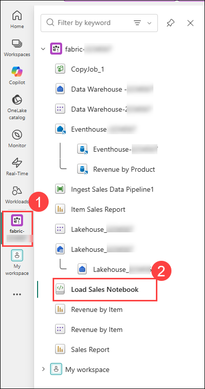

1. Add a new code cell in the notebook using **+ Code (1)**. Then, in the new cell, add the following code **(2)** and click on the run cell icon **(3)**:

   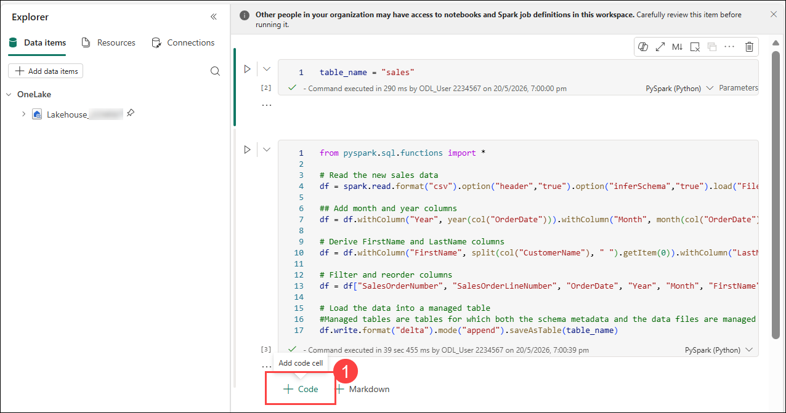

   ```python
   from notebookutils import mssparkutils
   from pyspark.sql.types import *
   from pyspark.sql.functions import *

   # Create a folder
   inputPath = 'Files/delta/'
   mssparkutils.fs.mkdirs(inputPath)

   # Create a stream that reads data from the folder, using a JSON schema
   jsonSchema = StructType([
   StructField("device", StringType(), False),
   StructField("status", StringType(), False)
   ])
   iotstream = spark.readStream.schema(jsonSchema).option("maxFilesPerTrigger", 1).json(inputPath)

   # Write some event data to the folder
   device_data = '''{"device":"Dev1","status":"ok"}
   {"device":"Dev1","status":"ok"}
   {"device":"Dev1","status":"ok"}
   {"device":"Dev2","status":"error"}
   {"device":"Dev1","status":"ok"}
   {"device":"Dev1","status":"error"}
   {"device":"Dev2","status":"ok"}
   {"device":"Dev2","status":"error"}
   {"device":"Dev1","status":"ok"}'''
   mssparkutils.fs.put(inputPath + "data.txt", device_data, True)
   print("Source stream created...")
   ```

    
          
1. Ensure the message *Source stream created...* is printed. The code you just ran has created a streaming data source based on a folder to which some data has been saved, representing readings from hypothetical IoT devices.

    

1. Add a new code cell by clicking on **+ Code (1)**. Add the following code **(2)** and click on the run cell icon **(3)**. This code writes the streaming device data in delta format to a folder named **iotdevicedata**. Because the path for the folder location is in the **Tables** folder, a table will automatically be created for it.

    ```python
   # Write the stream to a delta table
   delta_stream_table_path = 'Tables/dbo/iotdevicedata'
   checkpointpath = 'Files/delta'
   deltastream = iotstream.writeStream.format("delta").option("checkpointLocation", checkpointpath).start(delta_stream_table_path)
   print("Streaming to delta sink...")
    ```

    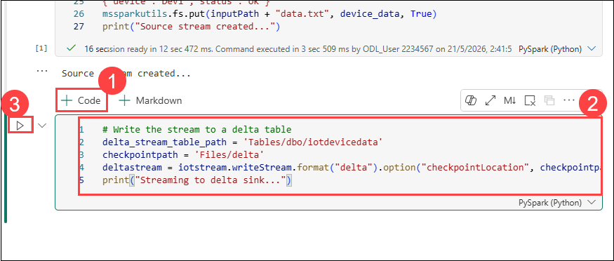

    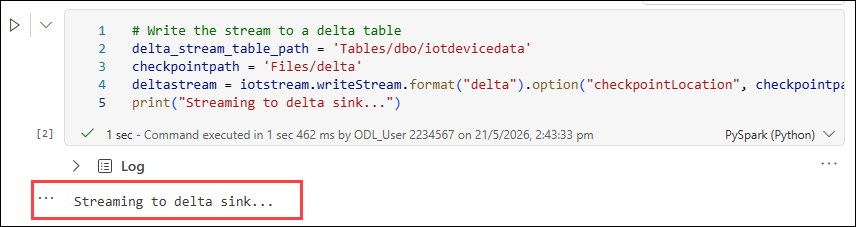    

1. Add a new code cell by clicking on **+ Code (1)**. Add the following code **(2)** and click on the run cell icon **(3)**. This code queries the **IotDeviceData** table, which contains the device data from the streaming source. 

    ```SQL
   %%sql

   SELECT * FROM IotDeviceData;
    ```
    
    

    > **Note:** If you encounter an error indicating that the IOTDeviceData table is not found after running the above command, execute the command below to create the table. 

    > ```SQL
    > %%sql
    > CREATE TABLE iotdevicedata
    > USING DELTA
    > LOCATION 'Tables/dbo/iotdevicedata';
    > ```

    > Once the table is created, re-run the previous step: `SELECT * FROM IotDeviceData;`

1. Add a new code cell by clicking on **+ Code**. Add the following code and click on the run cell icon. This code writes more hypothetical device data to the streaming source.

    ```python
   # Add more data to the source stream
   more_data = '''{"device":"Dev1","status":"ok"}
   {"device":"Dev1","status":"ok"}
   {"device":"Dev1","status":"ok"}
   {"device":"Dev1","status":"ok"}
   {"device":"Dev1","status":"error"}
   {"device":"Dev2","status":"error"}
   {"device":"Dev1","status":"ok"}'''

   mssparkutils.fs.put(inputPath + "more-data.txt", more_data, True)
    ```

    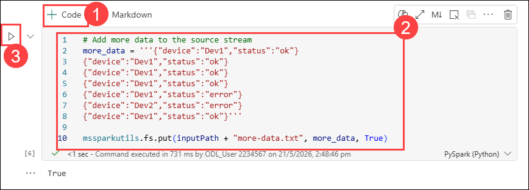

1. Re-run the cell containing the code below. This code queries the **IotDeviceData** table again, which should now include the additional data that was added to the streaming source.

    ```SQL
   %%sql

   SELECT * FROM IotDeviceData;
    ```

    

1. Add a new code cell, and run the following code:

    ```python
   deltastream.stop()
    ```

    >**Note:** This code stops the stream.

1. Click the **Stop** icon in the top menu bar to halt the notebook.

    > **Note:** Make sure the session is stopped; or the new notebooks won't work.

    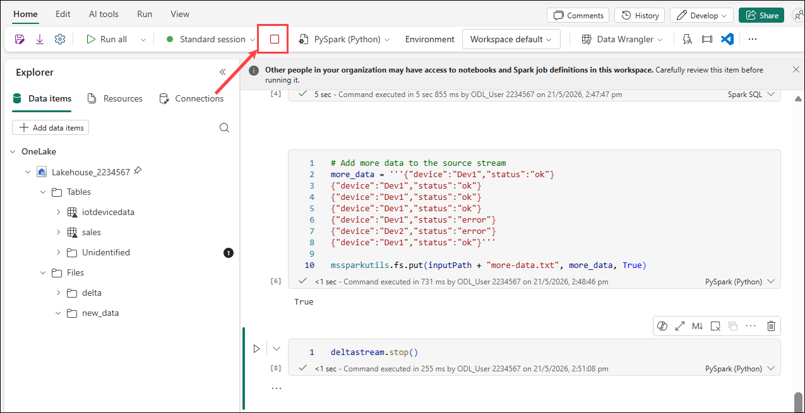

## 🧾 Summary

In this exercise, you:
- Created a Lakehouse to store and manage structured data.
- Set up a KQL (Kusto Query Language) database to analyze the data stored in the Lakehouse.
- Used KQL queries to explore and extract insights from the data.
- Created a query set based on your KQL analysis.
- Used the query set as the data source for a Power BI report to visualize the results.

### You have successfully completed the exercise. Click on **Next >>** to proceed with the next exercise.

   
