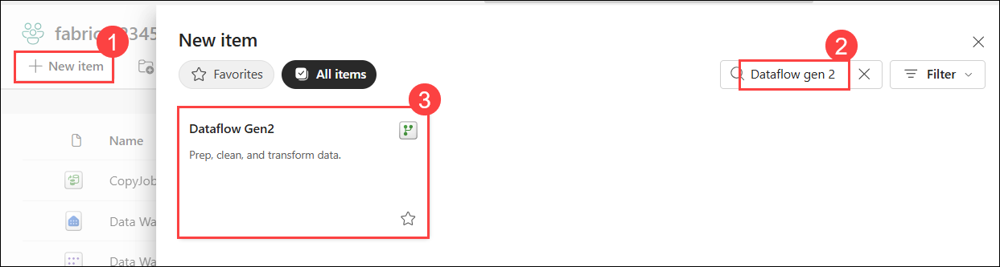
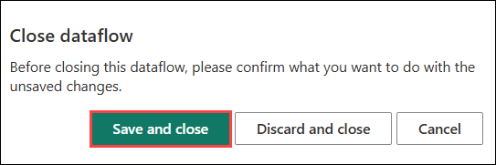
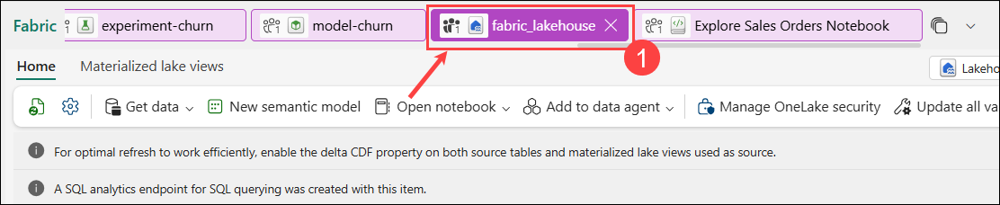
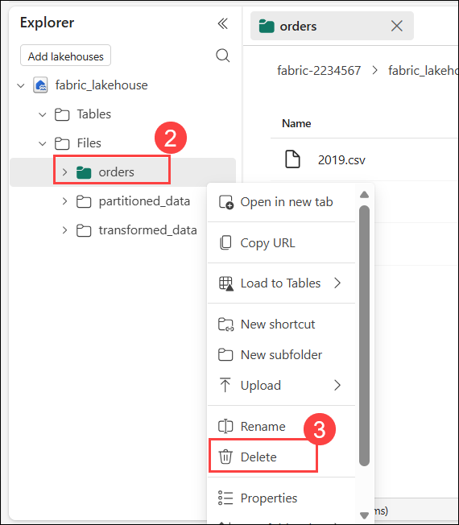
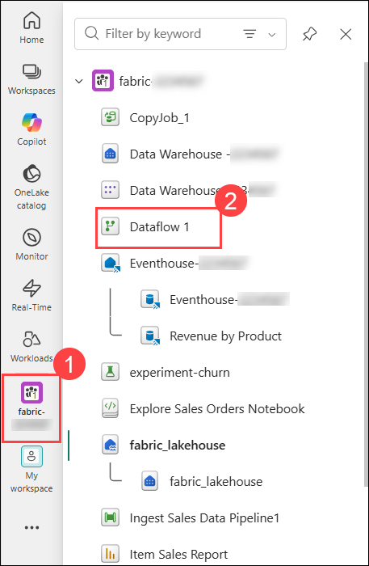
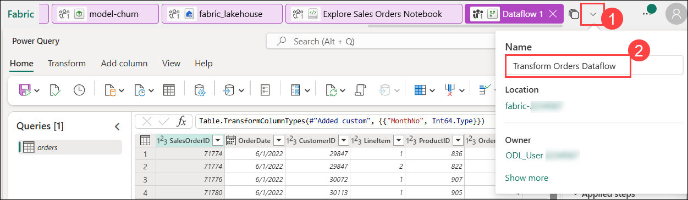
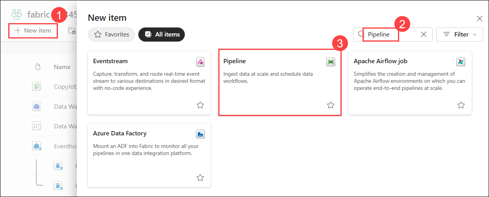

# Exercise 6: Create a Dataflow (Gen2) in Microsoft Fabric

### Estimated Duration: 50 Minutes

## 📘 Scenario

Contoso Retail’s data integration team needs a streamlined process to ingest, transform, and load sales order data into the organization’s Lakehouse environment. To support this workflow, the team plans to use Dataflow Gen2 and pipelines in Microsoft Fabric to automate data preparation and loading processes.

In this exercise, you will help Contoso create a Dataflow Gen2 to ingest and transform sales data, configure a Lakehouse destination for the processed data, and integrate the Dataflow into a pipeline for automated execution.

## 📖 Overview

In this exercise, you will use Dataflow Gen2 in Microsoft Fabric to ingest and transform sales order data using Power Query Online. You will create a Dataflow, apply data transformations, configure a Lakehouse destination, publish the Dataflow, and integrate it into a pipeline to automate data processing and loading into the Lakehouse.

## 🎯 Objectives

In this exercise, you will be able to complete the following tasks:

- Task 1: Create a Dataflow (Gen2) to ingest data
- Task 2: Add data destination for Dataflow
- Task 3: Add a dataflow to a pipeline

## Task 1: Create a Dataflow (Gen2) to ingest data

In this task, you will create a Dataflow (Gen2) to efficiently ingest and transform data from multiple sources for analysis. This process streamlines data preparation, enabling you to prepare the data for further processing and insights.

1. In the left pane, navigate to **Workspaces (1)** icon and select **fabric-<inject key="DeploymentID" enableCopy="false"/> (2)**. 

    

1. Click on **+ New item (1)** to create a new lakehouse. In the search box, search for **Dataflow Gen 2 (2)** and select **Dataflow Gen 2 (3)** from the list. 

   
   
1. Keep as default **(1)** and click on **Create (2)**. After a few seconds, the Power Query editor for your new data flow will open.

   

1. From the center **Get data** pane, select **Import from a Text/CSV file**.

   

1. Create a new data source with the following settings:

    - **Link to file: (1)** *Selected*
    - **File path or URL: (2)** `https://raw.githubusercontent.com/MicrosoftLearning/dp-data/main/orders.csv`
    - **Connection: (3)** Create new connection
    - **Connection Name:** Connection
    - **Data gateway: (4)** (none)
    - **Authentication kind: (5)** Anonymous
    - **Privacy level: (6)** None
    - Click **Next (7)**

      

1. Preview the file data, and then click **Create** the data source. The Power Query editor shows the data source and an initial set of query steps to format the data, as shown below:

   

1. Select the **Add column  (1)** tab on the toolbar ribbon. Then, choose **Custom column (2)**.

   

1.  On the Custom column pane, create a new column with Name **MonthNo (1)** and enter the formula **Date.Month([OrderDate]) (2)** in the **Custom column formula** box and then click **OK (3)**.

      

1. The step to add the custom column is added to the query, and the resulting column is displayed in the data pane:

   

1. On the **Power Query editor** page, click the **Close** button at the top-right corner to exit the editor.  

   

4. On the **Close** confirmation dialog box, click **Save and close** to confirm and exit.  

   

1. From the top menu, go to the **fabric_lakehouse<inject key="DeploymentID" enableCopy="false"/> (1)** Lakehouse, and then right-click on the **orders (2)** file and click on **Delete (3)**.

   

   

1. On the **Delete "orders"?** pop-up, click **Delete**.
   
   

## Task 2: Add data destination for Dataflow

In this task, you’ll add a data destination for the Dataflow to determine where the ingested and transformed data will be stored for future use.

1. From the left navigation pane, select your **fabric-<inject key="DeploymentID" enableCopy="false"/> (1)** workspace, and click on the **Dataflow 1 (2)** you created in the previous task.

    

1. In the **Query Settings** in the right pane, click on **+ (1)** for Data destination, then choose **Lakehouse (2)** from the drop-down menu.

   

   >**Note:** If this option is greyed out, you may already have a data destination set. Check the data destination at the bottom of the Query settings pane on the right side of the Power Query editor. If a destination is already set, you can change it using the gear.

1. In the **Connect to data destination** dialog box, make sure **Create a new connection (1)** is selected and the **<inject key="AzureAdUserEmail"></inject> (2)** account is signed in. Click on **Next (3)**.

   

1. Select the **fabric-<inject key="DeploymentID" enableCopy="false"/>** Workspace. Choose the **fabric_lakehouse<inject key="DeploymentID" enableCopy="false"/> (1)** then specify the new table name as **orders (2)**, then click **Next (3)**.

   

   > **Note:** If you are unable to select the Lakhouse, please expand it and select any folder created under it.

1. On the Destination settings page, observe that **MonthNo** is not selected in the Column mapping, and an informational message is displayed.

   
 
1. On the Destination settings page, first **toggle off (1)** the **Use automatic settings** option. Next, under the **MonthNo** column header, set the **Source type** to **Whole number (2)**. Finally, click **Save settings (3)** to apply the changes.

   

1. Select **Save and close** to save the dataflow. Then wait for the **Dataflow** to be created in the workspace.

   

1. After publishing, you will be navigated away from the Dataflow page. Wait for a few minutes for the Publish to complete, then open the **Dataflow**. 

1. Click on the **Dataflow (1)** on the top left, and rename the dataflow as **Transform Orders Dataflow (2)**.

   

## Task 3: Add a dataflow to a pipeline

In this task, you’ll add a dataflow to a pipeline to streamline the data processing workflow and enable automated data transformations.

1. In the left pane, navigate to **Workspaces (1)** icon and select **fabric-<inject key="DeploymentID" enableCopy="false"/> (2)**. 

    

1. Click on **+ New item (1)** to create a new lakehouse. In the search box, search for **Pipeline (2)** and select **Pipeline (3)** from the list.

    

1. Set the Name as **Load Orders pipeline (1)** and click on **Create (2)**. This will open the pipeline editor.

   

   > **Note:** If the Copy Data wizard opens automatically, close it!

1. Click on the **Pipeline activity (1)**, and select **Dataflow (2)** activity.

   

1. With the new **Dataflow1** activity selected, go to the **Settings (1)** tab in the bottom. In the **Workspace** drop-down list, choose **fabric-<inject key="DeploymentID" enableCopy="false"/> (2)** and in the **Dataflow** drop-down list, select **Transform Orders Dataflow (3)** (the data flow you created previously).

   
   
1. **Save** the pipeline from the top left corner.

   

1. Use the **Run** button to run the pipeline, and wait for it to complete. It may take a few minutes.

   
   
   

1. From the left navigation pane, select **fabric-<inject key="DeploymentID" enableCopy="false"/>** then select the **fabric_lakehouse<inject key="DeploymentID" enableCopy="false"/> (1)** Lakehouse.

1. Expand the **Tables** section and verify that the **orders** table is created by your dataflow.

   

   >**Note:** You might have to refresh the browser to get the expected output.

## 🧾 Summary

In this exercise, you:

- Created a **Dataflow (Gen2)** to ingest and prepare data.
- Added a **data destination** to store the output of the Dataflow.
- Integrated the **Dataflow into a pipeline** for automated data processing.

### 🎉 You have successfully completed the Hands-on lab.

By completing this hands-on lab, you have successfully implemented an end-to-end analytics and data processing solution using Microsoft Fabric for Contoso Retail. Throughout the lab, you worked through practical data engineering, analytics, and reporting tasks that closely align with real-world enterprise data workflows. You helped Contoso Retail establish a centralized analytics environment by creating workspaces, Lakehouses, and data warehouses to organize and manage business data efficiently. You automated data ingestion using pipelines and Dataflow Gen2, transformed and processed sales data using notebooks and Apache Spark, and enabled structured analysis through SQL, semantic models, and Power BI reports.

You also explored Real-Time Analytics using KQL to query operational data, worked with Delta tables and streaming data scenarios, and trained machine learning models using notebooks and MLflow to compare and track model performance. Additionally, you created visualizations and reports that support business analysis and data-driven decision-making. This lab demonstrated how Microsoft Fabric can unify data ingestion, transformation, analytics, machine learning, and reporting capabilities within a single platform. The tasks performed in this lab reflect common real-world responsibilities of data engineers, data analysts, and analytics teams working with enterprise-scale data solutions.

